## Paper info

Deterministic Replay: A Survey
- author: YUNJI CHEN, SHIJIN ZHANG, QI GUO, LING LI, RUIYANG WU, and TIANSHI CHEN
- from Chinese Academy of Sciences
- ACM Computing Surveys
- Publication year： 2016

---

# APPLICATIONS

## Judgment Criteria

- log size
- record slowdown
- replay slowdown
- implementation cost
- probe effect

---

## APPLICATIONS

### Program Debugging

- *probe effect / record slowdown*

### Online Program Analysis

- Online program analysis monitors and checks the data flow and control flow of program
execution on the fly, such as **taint analysis** (offload the heavyweight online analysis work to spare cores). ( *record and replay speeds*)

### Postsilicon Debugging

- engineers often need to replay the behavior of a silicon chip on an RTL simulator with timing determinism so as to provide full visibility of internal signals for understanding the root of the silicon bug. (*log size / Record slowdown*)

---

## APPLICATIONS

###  Fault Tolerance

- Transient fault refers to one-off misbehavior of the circuit since it is very unlikely that a transient fault can affect both the record run and the replay run (especially when they are well isolated).  (*record slowdown / replay slowdown*)

### Performance Prediction

- Predicting the performance of a parallel program on a currently unavailable machine. (*record slowdown*)

### Intrusion Analysis

- Intrusion analysis manages to understand intrusion attack and recover from intrusion damage through analyzing logs. (*record slowdown / Log size*)

# TAXONOMY

---

## TAXONOMY

### Single-Processor/Multiprocessor
uncertain inputs from the outside world / the interprocessor communications

### Single-Threaded Program/Multithreaded Program

### Abstract Level

We say that a deterministic replay scheme is defined at abstract level A if the scheme regards all the layers lower than A as the outside world of the program P

---

## TAXONOMY

### Abstract Level

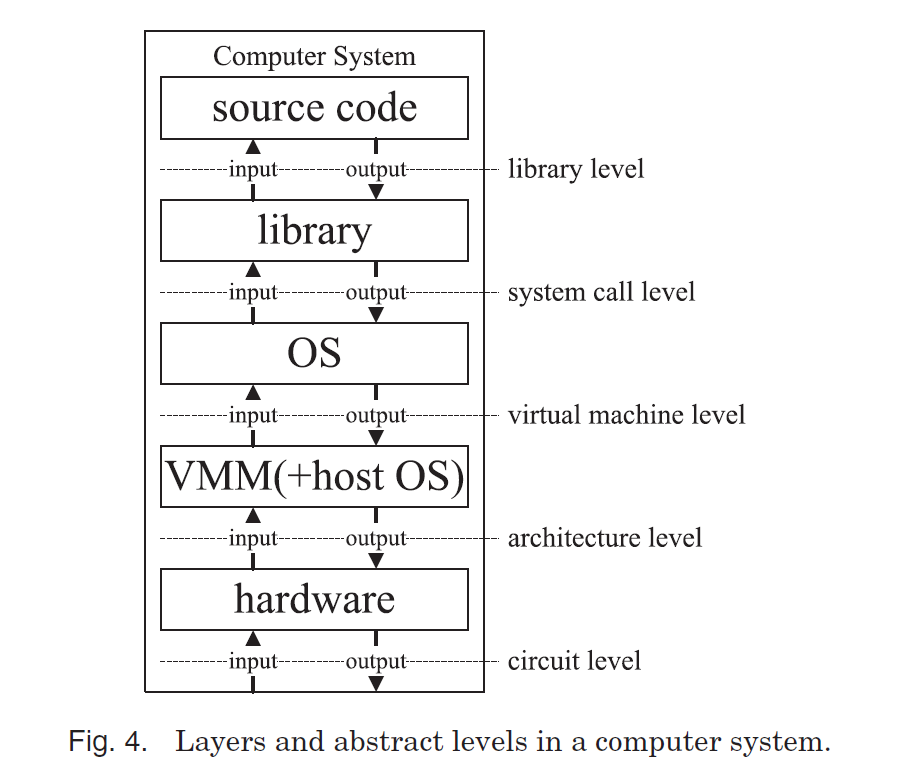

---

## TAXONOMY

### MPI/Shared Memory

### Message Recording Style

content-based schemes / ordering-based schemes.

### Shared-Memory Recording Style

- recording all synchronizations and a superset of all data races
- recording synchronizations and program outputs in the record run and managing to reproduce 
- deterministic parallelism

### Hardware Assisted/Software Only

---

## TAXONOMY

### Fidelity:

-  timing determinism.
-   logical determinism
-  output determinism.

---

## TAXONOMY

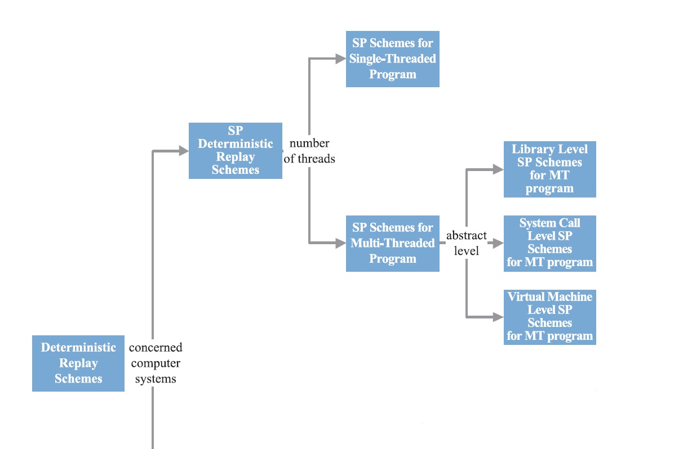

---

## TAXONOMY

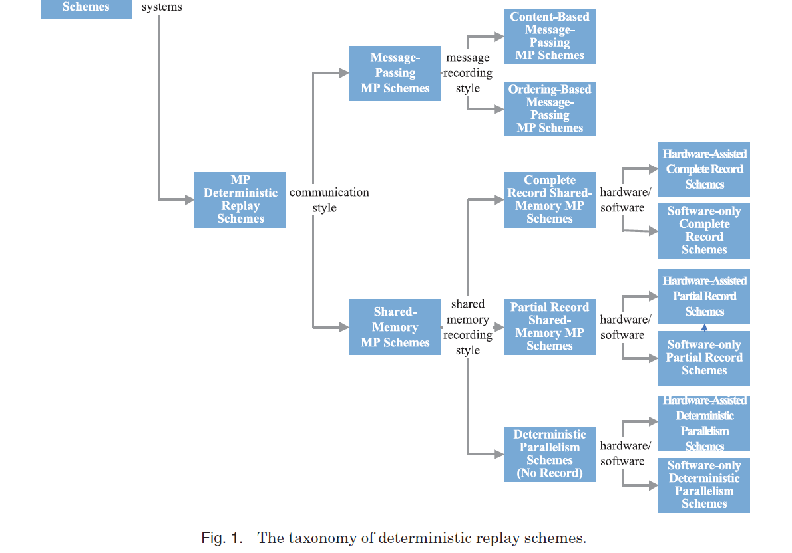

# SINGLE-PROCESSOR DETERMINISTIC REPLAY SCHEMES

---

## SP Schemes Dedicated to Single-Threaded Programs: a mature technology

So far SP deterministic replay schemes for single-threaded programs have already been incorporated in industry-level debuggers, and an example is GDB7.0 [GNU 2009].

---

## SP Schemes Dedicated to Single-Threaded Programs: a mature technology

### nondeterministic factors:

- Uncertain instruction.
- Uncertain function
- System call
- Interrupt and signal:  appended on an instruction and record the serial number of the instruction
- Trap
- I/O operation
- DMA: 
	- directly record the I/O behaviors of the CPU 
	- one can record the time point when the DMA controller informs the processor about the end of a DMA transaction
	- treats  the DMA device as an extra processor

---

## SP Schemes Supporting Multithreaded Programs

- need to record process scheduling
- Virtual Machine Level: directly solve
	- Chow et al. [2010] proposed a multistage framework for deterministic replay, which can filter the uninterested information from the recorded logs to enable replaying the interested threads only.
- System Call Level
	- modify the operating system to record thread scheduling( Russinovich and Cogswell [1996])
- Library Level.
	- a common solution is to use a token to take over thread switching in both the record run and replay run [Geels et al. 2006]. Only the thread owning the token can move forward.

# MULTIPROCESSOR DETERMINISTIC REPLAY SCHEMES

---

## Message-Passing MP Scheme

- Most programs use Message Passing Interface (MPI) to communicate with each other.
- deal with uncertain MPI messages:
	- content-based schemes:  records the received data of all messages [Curtis and Wittie 1982]
	- ordering-based schemes: ecord the source of each message received by the wildcard receiving function [Netzer and Miller 1992].

---
## Message-Passing MP Scheme:

### content-based replay scheme: 
Data replay [Maruyama et al. 2005]: Log the effect of MPI functions, and replay it from the log.

advantage:  replay a specified process alone and ignore all other processes
disadvantage: high recording overhead and huge logs

---

## Message-Passing MP Scheme:

### ordering-based schemes: 
Netzer and Miller [1992] proposed to further reduce the recording overhead of ordering-based schemes through pursuing the transitive **happen-before relationship** between MPI functions.

1. a and b are on the same process, and a is before b in program order;
2. there is a message sent by a and received by b;
3. there exists an access c such that a happens before c and c happens
before b.

---

## Message-Passing MP Scheme:

### ordering-based schemes: 

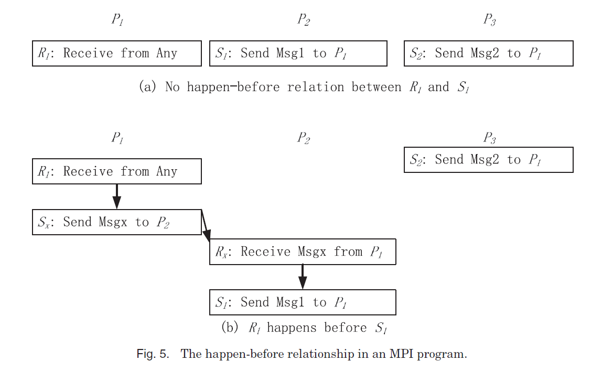

---

## Message-Passing MP Scheme:

### mixed  schemes: 

MPIWiz [Xue et al. 2009] is a novel deterministic replay scheme that combines the advantages
of content-based replay and ordering-based replay.  Intergroup messages are logged in a content-based manner, and intragroup messages are logged in an ordering-based manner.

---

## Shared-Memory MP Schemes: 

Main task: deal with data race

1. Complete record schemes
2. Partial record schemes
3. Deterministic parallelism schemes

Two kands:  Hardware-Assisted Schemes and Software-Only Schemes

---

## Complete Record Schemes

---

## Hardware-Assisted Schemes: FDR

- FDR (flight data recorder) [Xu et al. 2003] utilizes directory-based cache coherence messages to carry additional information for recording orderings of shared-memory operations.
- instruction counter (IC): count its last retire instruction
- cache instruction counter (i : CIC[b]): count the last instruction accessing b on core i.

---

## Hardware-Assisted Schemes: FDR

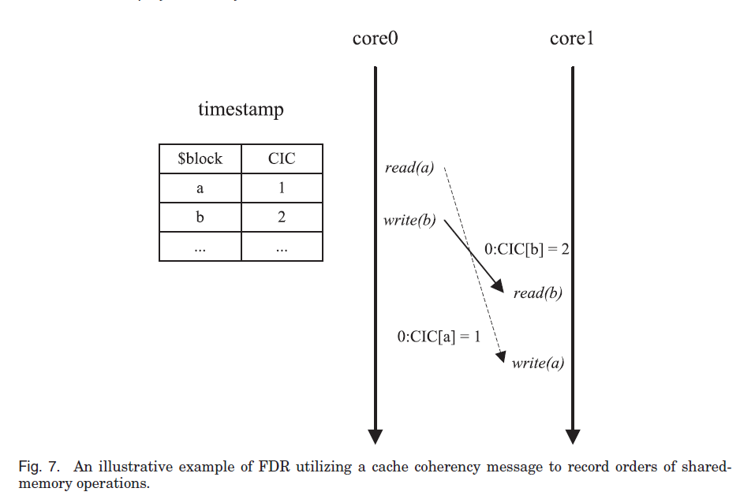

---

## Hardware-Assisted Schemes: Rerun

Rerun [Hower and Hill 2008] is a kind of scheme that manage to record the orderings among instruction trunks. 

Each trunk ends when one of its memory operations is conflicting with some memory operation of a concurrent trunk running on another core. 

---

## Hardware-Assisted Schemes: Rerun

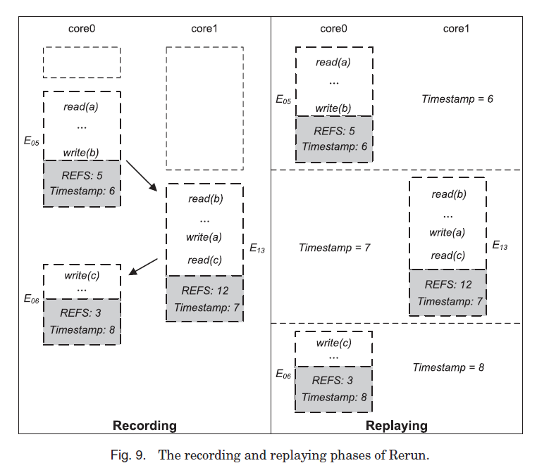{height=90%}

---

## Hardware-Assisted Schemes: other researches

- DeLorean [Montesinos et al. 2008]: fixed size trunks. When conflict: abort and re-execute
- DeLorean provides an additional PicLog mode. In the mode, even the orderings between trunks are predefined
- there are schemes that further reduce log sizes of trunk-based replay, such as Timetraveler [Voskuilen et al. 2010] and LReplay [Chen et al. 2010].

---

## Software-Only Schemes: SMP-ReVirt

- SMP-ReVirt [Dunlap et al. 2008] utilizes **existing hardware page protection functionality** to detect pagegrain conflicts between memory operations of different virtual processors in a multiprocessor virtual machine.
- It manages the read/write privilege of each page with a concurrent-read, exclusive-write (CREW) protocol
- disadvantage:  the slowdown of record run is remarkable (can even be 10 times).

---

## Software-Only Schemes: SMP-ReVirt

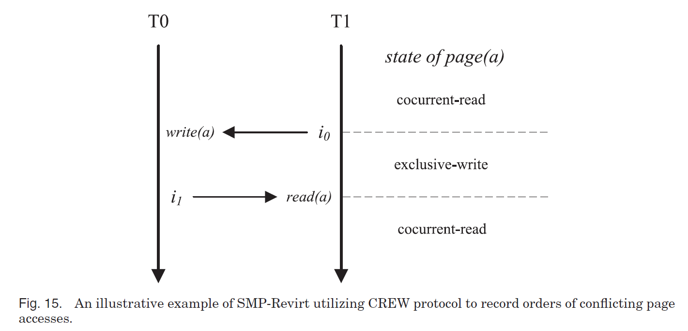

---

## Software-Only Schemes: PinPlay

- PinPlay [Patil et al. 2010] tracks each individual memory operation based on a dynamic instrumentation tool, Pin [Luk et al. 2007].
- It results in significant slowdown in the record run.

---

## Partial Record Schemes

- Only guarantee identity output.
- do not record orderings among other shared-memory operations: deduce or rely on iterative trials

Two kinds: Hardware-Assisted Schemes and Software-Only Schemes.

---

## Hardware-Assisted Schemes

- Lee et al. [2009, 2011] propose to reuse existing load-based checkpoint schemes to record only program inputs. The shared-memory dependencies can be reconstructed by offline symbolic analysis.

- By satisfying these constraints, the Satisfiability Modulo Theory(SMT)-based offline solver can find multiple valid totaling orders.

- disadvantage: analysing time increases very quickly as the number of processer increase.

---

## Hardware-Assisted Schemes

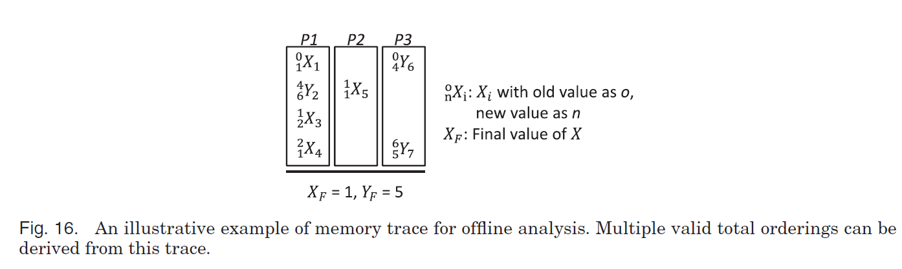

---

## Software-Only Schemes: RecPlay [Ronsse and de Bosschere 1999]

A pioneer. Does not manage data race. Not practical.

---

## Software-Only Schemes: ODR

Altekar and Stoica [2009] proposed ODR (Output-Deterministic Replay). 

Mentioned lastweek.

---

## Software-Only Schemes: PRES

PRES (Probabilistic Replay with Execution Sketching) is another representative software-only partial record scheme [Park et al. 2009]. 

- PRES utilizes a depth-first heuristic algorithm to find a suspect data race that might be responsible for the failure of the last replay trial to reduce the attemps.

---

## Software-Only Schemes: PRES

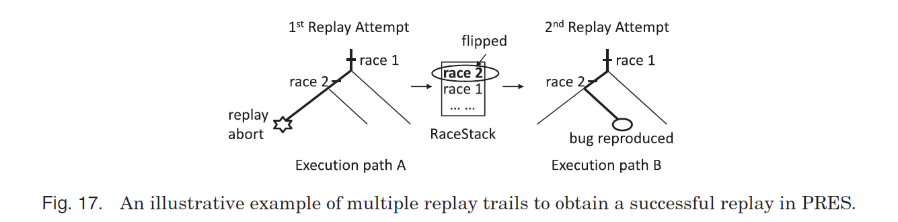

---

## Software-Only Schemes: DoublePlay

Veeraraghavan et al. [2011] proposed DoublePlay to convert traditional thread parallelism (executing each thread on different cores) into epoch parallelism (executing all threads of an epoch on one core) for efficient deterministic replay.

(mentioned before)

---

## Deterministic Parallelism Schemes.

The deterministic parallelism introduced in this part does not record any order of shared-memory operations (including synchronizations and data races), but instead forces shared-memory operations to **obey some predefined orders**.

Two kinds: Hardware-Assisted Schemes and Software-Only Schemes.

---

## Hardware-Assisted Schemes : DMP

DMP is a representative hardware-assisted deterministic parallelism scheme [Devietti et al. 2009].

- DMP-Serial a token is used to control the memory operations of all cores.  (hardware: token)
- DMP-ShTab divides each trunk into two parts: a parallel part and a serial part. (hardware: sharing table data structure)
- In the DMP-TM mode, all cores are allowed to simultaneously execute in a transactional manner. (hardware: enforce a specific transaction commit order)

disadvantage: designed for the sequential consistency model

---

## Hardware-Assisted Schemes : DMP

- DMP-TM: 

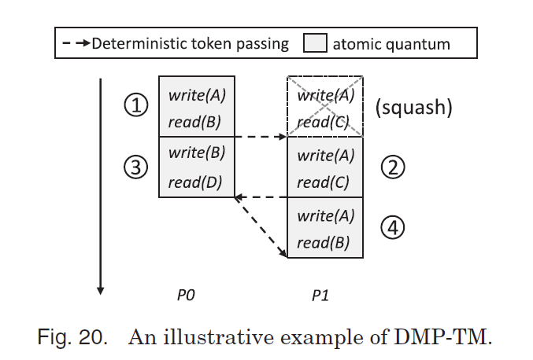{height=90%}

---

## Hardware-Assisted Schemes : RCDC

Devietti et al. [2011] proposed RCDC to achieve deterministic parallelism on systems providing relaxed memory consistency models.

- The execution of a round of quantums has two phases: the parallel phase and the commit phase.
- Each core saves all stores performed in the parallel phase of a quantum in its local buffer (and thus they are temporarily invisible to other cores).
- In the commit phase, each quantum in the round is serially committed in a deterministic order

hardware:  precise instruction counting and store data buffering.

---

## Hardware-Assisted Schemes : RCDC

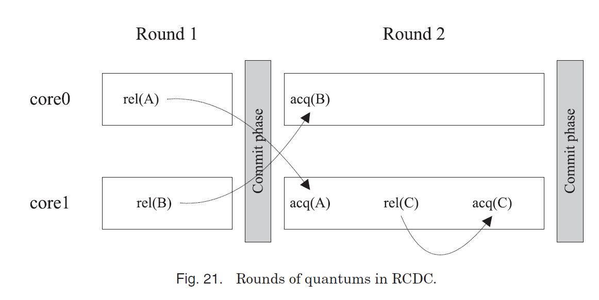{height=90%}

---

## Hardware-Assisted Schemes : Calvin

Hower et al. [2011] proposed a hardware-assisted deterministic parallelism scheme named Calvin. Calvin provides **three modes**: conventional mode, bounded deterministic mode, and unbounded deterministic mode.

---

## Software-Only Schemes: Kendo

- focuse on enforcing deterministic synchronization orders.

- use deterministic logical time (DLT) to compute a deterministic yet load-balanced interleaving of synchronizations.

- disadvantage: Kendo does not consider data races

---

## Software-Only Schemes: Kendo

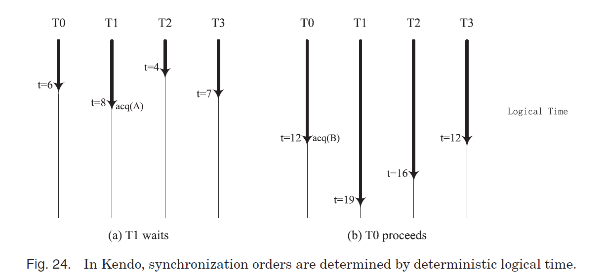

- commits a store instruction or spins on a contested lock: logic clock +=1

---

## Software-Only Schemes: CoreDet

CoreDet [Bergan et al.2010] is a compiler and runtime system that can enforce deterministic parallelism for all shared-memory operations

- DMP-O is the software implementation of DMP-ShTab in DMP
- DMP-B executes multithread programs in rounds of quantums, each quantum in DMP-B has a fixed length. three phases: parallel phase, commit phase, and serial phase. 
- DMP-PB  partitions the whole memory into thread-private and shared spaces to reduce the amount of buffer queries.

# CONCLUSION

---

Though It is difficult (if not impossible) to design ideal scheme, especially for shared-memory systems, it is still feasible to design application-oriented schemes for specific application scenarios that often do not simultaneously require all five desirable characteristics.

