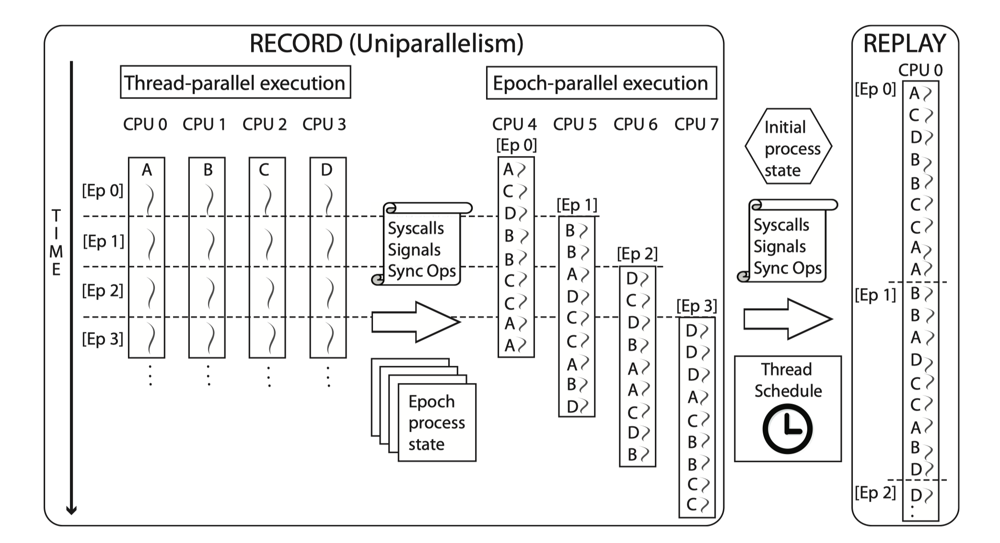

# The Plan

## Haonan

- Paper reading: George W. Dunlap, Peter M. Chen, "Execution replay on multiprocessor virtual machines", VEE'08

- Document collecting: write and collect some documents for ETM, Arm-TF

---

<!-- This is Wenxuan's Part -->

# Multiple Source of Truth

multiple source of truth in mordern computer:

- Multiple core modify the same area of the memory
- Device Memory Access (CPU does not even know it!)

---

# The replayer's view

Do we really care what happened in the memory?

Actually we only care about the **input data** and **output data** of the program rather than the status of whole system.

---

