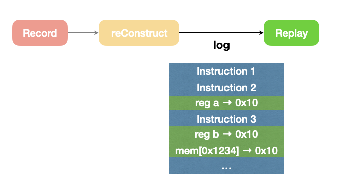
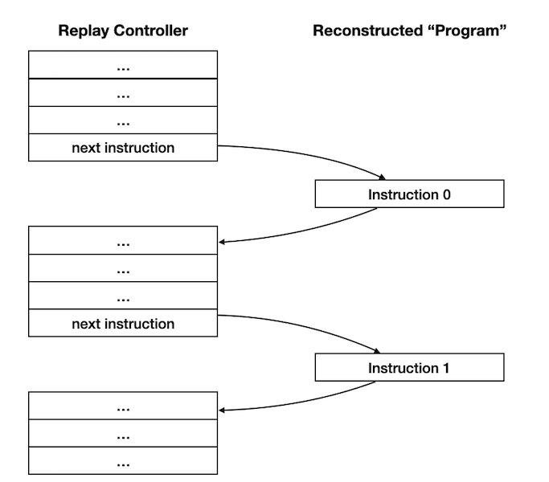
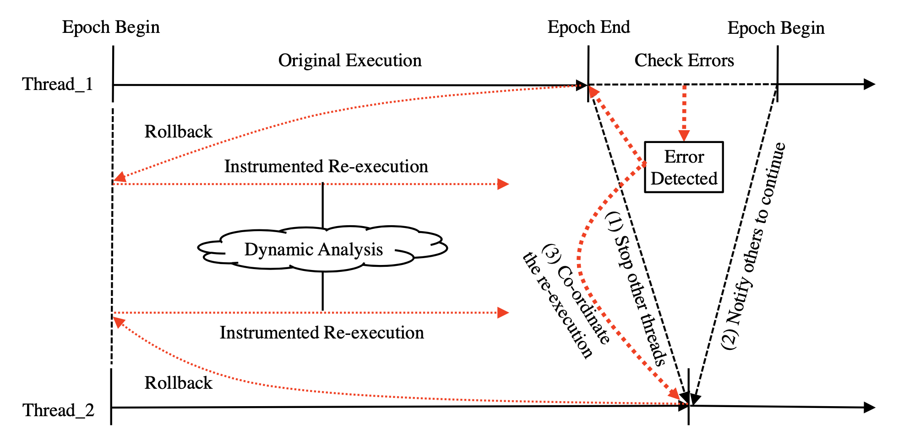

# The plan

## Wenxuan & Xueying

- Sync

## Haonan

1. Read a paper: "iReplayer: In-situ and Identical Record-and-Replay for Multithreaded Applications"

---

# Wenxuan's work

## Replayer Impl
Discuss in next slides

## read the paper "REPT"
Wrote a blog, [My notes on REPT:Reverse Debugging of Failures in Deployed Software](https://www.whexy.com/2021/01/21/REPT/)

---

# Input

Record and reConstruct provide log (including every instruction and data change) to **replayer**.

---

# Replayer == Browser

---

# Functionality

All registers and memories are **immutatable** during debugging.

Provide developers filters, searching tools to understand how program goes.

The workload is almost none!

---

# Replayer version 2

- The instructions actually **run** in the processors.
- Developers can manipulate replay.

---

---

# Challanges of version 2

Say, we want to have a replayer written in C/C++.

1. Analyse the record log
2. Read user input commands (continue, reverse, goto, ...)
3. Dynamically run assembly

Notice we are writting a replayer running as a normal program, the hard parts are:

1. Assembly are **run-time** determined, rather than determined during compiling.
2. We don't know what assembly will do, it may do something harmful, like modify a register we used in the replayer, or override stack in the memory.

---

# Challanges of version 2 - Cont'd

## Challange 1
Q: Assembly are **run-time** determined, rather than determined during compiling.

A: We might need to modify `PC` register in some hacky ways.

---

# Challanges of version 2 - Cont'd

## Challange 2
Q: Assembly may do something harmful.

A: We need a good isolation. Maybe a virtual machine?
    
## Challange 3
Q: If running in actual host, how to manage the context?

A: context switch! Can OS help? Let one thread (replay controller) to control another thread (assembly)? How?

## Challange 4

Q: If OS can't help, switch context by our own, **language-level**?

A: Associated with the C++ Coroutine. Coroutine needs to store and restore the scene.

---

# Replay Design

TO BE DECIDED.

---

# Paper Introduction

- Hongyu Liu, Tongping Liu et al. "iReplayer: In-situ and Identical Record-and-Replay for Multithreaded Applications", PLDI’18

- University of Texas at San Antonio, Huawei US Lab

- Only replay the execution **if necessary**

- ~~This paper was rejected 7 times~~

---

# Types of Replay

  - *Lawful*: replay is re-execution (ReVirt)
  - *Neutral*: capture/snapshot is also replay (TTD, REPT)
  - *Chaotic*: rollback is also replay (iReplayer)

---

# iReplayer
Desgin goal: in-situ, identical, efficient

---

# Syscalls in Different Types

|Category| Syscall Examples|
|--------|-----------------|
|Repeatable |`getpid`, `getcwd`|
|Recordable |`gettimeofday`, `mmap`, `open`|
|Revocable |file `read`/`write`|
|Deferrable |`close`, `munmap`, (thread exits)|
|Irrevocable |`fork`, `lseek`|

---

# About REPT: OSDI'18

- "Reverse Debugging of Failures in Deployed Software"
- They adapted and deployed in WinDbg (see: https://youtu.be/0VUy4mqA_Lk)
- An improvement of *Time Travle Debugging*

---

# XueYing's work

Study TOEFL and lay down as a salt fish. 

---

# Plan

## Haonan
- For these categories of syscalls, to find some ways to record

## Wenxuan
- Understand the design graph
- Find ways to replay.
