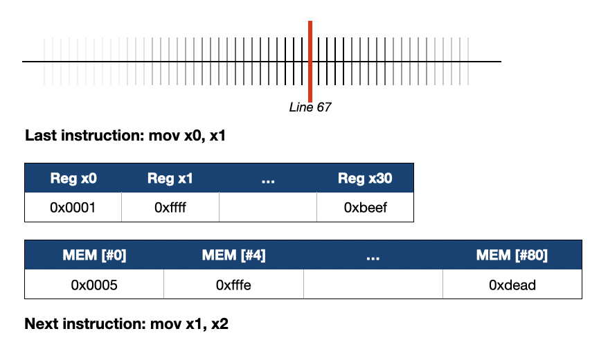

# Seminar-slides Markdown Guideline

## Empty Lines

Leave a blank line between all **non-intimate** elements. The specific rules are as follows.

- Leave a blank line between the separator and the contextual content.
- A blank line between the title and the content.
- Leave a blank line at deliberate line breaks.

Intimacy exception.

- No blank lines should be left between unordered lists and ordered lists.
- No blank lines should be left between content that needs to be kept continuous.

---

## Example

```markdown
this is the last line of the page, content ends.

---

## A Title

This is the line 1 in the page, aba, aba.

This is the line 2 in the page, bala, bala,
and this is also the line 2 in the page,
and this is still the line 2 in the page.

- My point 1
- My point 2
```

---

## The title symbol

::: columns

:::: column

### Example {.shrink}

```markdown
# Section name

## A title

This is content.

---

## B title

This is content.

### A block title

Foo Bar
```

::::

:::: column

- Use `#` as section separator, `##` as page title, and `###` as block separator.
- `#` (section) must be followed by `##` and cannot be immediately followed by content.

:::: 


:::

---

# Pandoc Syntax

## How to: The column example

### Guide
The page is written by Wenxuan to show you guys how to create double columns in markdown to beamer.

. . .

### Sample

::: columns

:::: column

Left side text.

Left side text again.

```rust
pub fn foo() {
  println!("Hello World");
}
```

::::

:::: column

Right side text.

- Can do anything.
- Can do almost everything.

::::

:::

---

## How to: The image example

Use syntax like `{height=80%}` to control height and width of images.

{height=80%}

---

## How to: Fancy layout

### Proposal

- Point A
- Point B

::: columns

:::: {.column width="40%"}

### Pros (40% width)

- Good
- Better
- Best

::::

:::: {.column width="60%"}

### Cons (60% width)

- Bad
- Worse
- Worst

::::

:::

### Conclusion

- Let's go for it!
- No way we go for it!